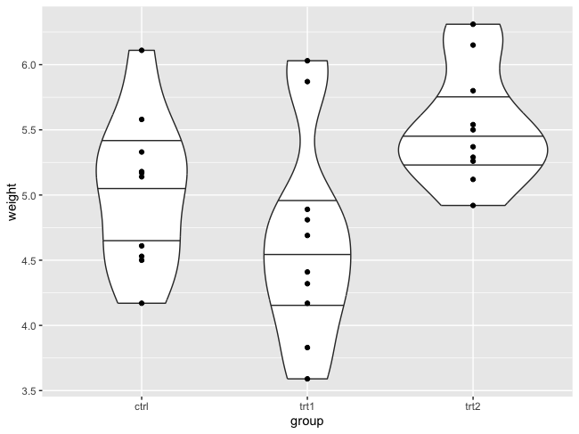

Congrats! You've made it to the end of the R workshop! We have prepared this documentation for you, where you will find all the code we wrote during the workshop. Don't hesitate to go through it again at your own pace to make sure you understand everything ;-) 

Have fun with R!

Celes, Lander, Lisa, Mustafa and Nikolas

# Introduction and Preparation (Celes Mbigha)

```{r}
#Getworking directory 
getwd()
#For this execrise set desktop as working directory 
setwd("~/Desktop")
```

## Installing and loading packages

```{r eval=FALSE}
#NB:Packages are installed once but loading every session
#YOU CLICK "Packages", "Install" and type the name of the packages
## install.packages("name_of_package")
install.packages("tidyverse")
library ("tidyverse") 

#To check which folder R installed packages
.libPaths()
```

## Exercise 1

```{r}
#Insatll and load the following packages
"ggplot2" 
"dplyr" 
"tidyr"
```

## Installing Bioconductor (packages)

```{r eval=FALSE}
#BiocManager::install("name_of_package")
BiocManager::install("ComplexHeatmap")
library ("ComplexHeatmap")
```

## Help

```{R}
#For commands
#help(command) OR ?(command)
help(sum)
?sum
example(sum)
#For packages 
help(package="ggplot2")
browseVignettes("ggplot2")
```

## Basic syntax in R

```{r}
#Text should be inside quotes (single or double)
"Hello" 
"say \"Hello\""

#'*Arithmetic operators* 
#Addition (+)
3 + 5
#Subtraction (-)
10 - 3
#Multiplication (() OR *)
4 * 6
#Division (/)
15 / 3

#Exponentiation (^ OR **)
2^3
2**3

#Modulo (%)
10 %% 3

#R follows the standard order of operations (PEMDAS/BODMAS)
3+4*(2**2)-12/3
#=The above equation is the same as;
(2**2)*4-(12/3)+3


#'*Arithmetic operators* 
#AND (& or &&)
(9 > 5) & (2 < 10)

#OR (| or ||)
(2+3 == 5) | (5+5 == 10)

#NOT (!)
!(10 > 30)
```


```{r setup, include=FALSE}
knitr::opts_chunk$set(echo = TRUE)
```

# Basics in R (Lisa Faye)
## R Data Types

R has 5 basic data types that are :  
* characters  
* numerics  
* integers  
* complexes  
* logicals  

### Characters  
A character is a text (or string) value typed between single ('') or double ("") quotes. 

```{r}
#To assign a value to a variable, you need to use the command: variable <- value
my_character <- "hello there"

#To print out the data type of a variable, you can use the function typeof() or class()
typeof(my_character)
```
### Numerics  
A numeric is a decimal value (also called double-precision real value). 

```{r}
my_numeric <- 3.14
typeof(my_numeric)
```
### Integers  
Integers are a subset of the numeric data type. Integers are whole values and are specified by the letter "L".

```{r}
my_integer <- 24
typeof(my_integer)
```
```{r}
my_integer <- 24L
typeof(my_integer)
```
### Complexes  
A complex number is a value with real and imaginary parts.

```{r}
my_complex <- 2+5i
typeof(my_complex)
```
### Logicals  
A logical is a boolean value (*TRUE* or *FALSE*). Be careful: Logicals are case sensitive. Writing *True* or *true* does not work.

```{r}
my_logical <- TRUE
typeof(my_logical)
```
## Arithmetic with R
R can also be used as a calculator. R follows the standard order of priority and accepts the following operators:  
Addition: `+`  
Subtraction: `-`  
Multiplication: `*`  
Division: `/`  
Exponentiation: `^`  

```{r}
x <- 4+2*6
y <- 2^10
    
#To print out the value of a variable, you can use the function print() or just type the name of the variable
print(x)
y
```
## R Data Structures
R’s basic data structures include the vector, list, matrix, data frame, and factors. Some of these structures require that all members be of the same data type (e.g. vectors, matrices) while others permit multiple data types (e.g., lists, data frames).

### Vectors  
A vector is the simplest and most used data structure in R. It is a collection of data values of the same type (e.g., all numerics, characters, logicals...). Vectors are called often atomic vectors as they can only accommodate one type of R data.      
The easiest way to create a vector is to use the c() function that *concatenates* several given elements.  

```{r}
color <- c("blue", "green", "orange", "red", "yellow") #vector of characters
size <- c(39, 43, 38, 41) #vector of numerics
phd <- c(TRUE, FALSE, FALSE) #vector of logicals
```

Let's have a look at the attributes of the vectors we just created:  

```{r}
class(color) #to print the type of elements in the vector
length(size) #to print the length of the vector
str(phd) #to print the structure/content of the vector
```
When combining vectors of different data types, one data type will outrule the other one(s). This conversion between types is called “coercion”.   
When R converts the mode of storage based on its content, it is referred to as “implicit coercion”.  
R applies the following rule is: Character > Numeric > Integer > Logical.

```{r}
i <- c(color, size)
print(i)
class(i)
```
You can also control the coercion using as.\<data_type>(). This is referred to as "explicit coercion".

```{r}
j <- as.character(size)
print(j)
class(j)
```
Manipulation of vectors: adding elements, using missing data, retrieving elements...  

**Adding an element**

```{r}
x <- c(color, "white")
x

y <- c(40, size)
y
```
**Manipulating missing data**  
  
Missing values are  represented  by  `NA`  (Not  Available)  without  quotes.  `NA`  represents  both  missing character and numeric data. NA values have a class also, so there are integer NA, character NA, etc... Impossible values (e.g., dividing by zero) are represented by the symbol `NaN` (Not A Number).  
`is.na()` is used to test objects if they are NA  
`is.nan()` is used to test for NaN  

```{r}
temp <- c(23, 24, 25, 18, 19, NA, NA)
is.na(temp)
```
**Retrieving elements**  

```{r}
color[2] #to retrieve the 2nd element of the vector
color[1:3] #to retrieve the elements between the 1st and 3rd position
color[c(2,4)] #to retrieve the 2nd and 4th elements
color[color!="green"] #to retrieve all the elements which are not equal to "green"
size[size>40] #to retrieve all the elements which value is above 40
```
### Matrices  

Matrices are vectors with two *dimensions*: the number of rows and the number of columns. The dimension attribute is itself an integer vector of length 2 (nrow, ncol). Matrices can hold numeric, character or logical values. The elements in a matrix all have the same data type.

```{r}
m <- matrix(nrow = 2, ncol = 3) #to create a matrix with 2 rows and 3 columns
m #to print the content of matrix m. The matrix will be filled with NAs if no values given.
dim(m) #to print the dimensions of the matrix m
```
Matrices are build *column-wise* so the entries will be put first in all the rows of column 1 before moving to column 2.  

```{r}
stud1 <- c(14,15)
stud2 <- c(10,11)
stud3 <- c(19,17)

grades <- matrix(c(stud1, stud2, stud3), nrow = 2, ncol = 3)
grades
```
You can change the names of the columns and the rows using colnames() and rownames().  

```{r}
rownames(grades) <- c("test A", "test B")
colnames(grades) <- c("student 1", "student 2", "student 3")
grades
```
You can add columns or rows to a matrix using cbind() or rbind(), respectively.  
```{r}
stud4 <- c(13, 15)
grades <- cbind(grades, stud4)
grades

colnames(grades)[4] <- "student 4" #to replace the name of the 4th column
grades
```
### Factors

Data often falls into a limited number of categories. For example, at a sport competition, athletes could get gold, silver, bronze or no medal. In R, categorical variables are stored in factors. Factors can be unordered or ordered. Factor objects can be created with the `factor()` function.

```{r}
medal <- factor(c("no", "silver", "bronze", "no", "no", "gold"))
medal
summary(medal)
```
The levels are ordered by alphabetical order by default. The order of the levels of a factor can be set using the `levels` argument to `factor()`.

```{r}
medal <- factor(c("no", "silver", "bronze", "no", "no", "gold"), levels = c("gold", "silver", "bronze", "no"))
summary(medal)
```
### Lists

Unlike vectors, the contents of a list are not restricted to a single type and can encompass any mixture of data types. Lists are sometimes called generic vectors, because the elements of a list can by of any type of R object. This property makes them fundamentally different from atomic vectors.

You can create lists using list(). 
```{r}
l <- list("blue", 23, TRUE)
```
An empty list of the required length can be created using vector().
```{r}
l_empty <- vector("list", length = 5)
```
You can name the components of a list.
```{r}
features <- list(eyecolor = c("blue", "brown", "black"), age = c(18,23,25), siblings = c(FALSE, TRUE, TRUE))
```
You can also name the components of a list using names(). 
```{r}
names(l) <- c("eyecolor", "age", "siblings")
```

**Retrieving components of a list**  
To retrieve a component of a list, you can use [[]], using either the position of the element in the list or the name of that component. You can also use the "$" sign followed by the name of the component.

```{r}
features[[1]]
features[["age"]]
features$siblings
```
### Data Frames

You will mostly work with data frames if you want to import and analyze datasets in R. A data frame is a special type of list where every component of the list has same length. Unlike matrices, data frames can store different classes of objects in each column. R has some built-in data frames that you can use to practice some manipulations. Let's have a look at the `iris` dataset.


```{r}
data(iris)
#view(iris) #opens a new tab containing the iris data frame
```

Here are some useful functions for data frames:

To show the first 6 rows: `head()`  
To show the last 6 rows: `tail()`  
To print the dimensions of data frame (i.e. number of rows and number of columns): `dim()`  
To print the number of rows: `nrow()`  
To print the number of columns: `ncol()`  
To print the structure of a data frame (i.e. name, type and preview of data in each column): `str()`  
To show the names attribute for a data frame: `names()` or `colnames()`  
To show the class of each column in the data frame: `sapply(<dataframe>, class)`  
  
Let's have a look at our dataset:
```{r}
dim(iris) 
colnames(iris)
str(iris)
```
**Retrieving elements**

To retrieve an element based on its column and row numbers
```{r}
iris[2,3] #to retrieve the second element in the 3rd column
iris[1:3, "Sepal.Width"] #to retrieve the first 3 sepal widths
```
To select one column from the data frame
```{r eval=FALSE}
iris[,4] #based on the column number
```


```{r, eval=FALSE}
iris[,"Petal.Width"] #based on the column name
```


```{r}
iris$Petal.Width #based on the column name
```

**Filtering the rows of a data frame**
```{r}
iris[iris$Species == "setosa",] #subsets the flowers (rows) that belong to "setosa" species.
```


```{r, eval=FALSE}
iris[iris$Species %in% c("setosa", "virginica"),] #subsets the flowers (rows) that belong to "setosa" or the "virginica" species.
```


```{r}
iris[iris$Species == "setosa" | iris$Species == "virginica",] #the pipe '|' means 'OR'
iris[iris$Petal.Length > 6,] #subset the flowers (rows) for which the petal length is above 6cm.
iris[iris$Species == "virginica" & iris$Sepal.Length >= 7.5,] #the symbol '&' means 'AND'
```

**Operations on the columns of a data frame**
```{r}
iris$Ratio.Sepal.Petal <- iris$Sepal.Length/iris$Petal.Length #creates a new column to store the ratio of the sepal legnth to the petal length
iris$Av.Sepal.Length[iris$Species=="setosa"] <- mean(iris$Sepal.Length[iris$Species=="setosa"]) 
iris$Av.Sepal.Length[iris$Species=="versicolor"] <- mean(iris$Sepal.Length[iris$Species=="versicolor"]) 
iris$Av.Sepal.Length[iris$Species=="virginica"] <- mean(iris$Sepal.Length[iris$Species=="virginica"])
```

You can also use a loop to perform the last 3 commands at once:
```{r}
species <- unique(iris$Species)

# Use a for loop to calculate and assign the average sepal length for each species
for (s in species) {
  iris$Av.Sepal.Length[iris$Species == s] <- mean(iris$Sepal.Length[iris$Species == s])
}
```

**Export a data frame**
You can save a data frame as a .tsv (tab-separated values) file or a .csv (comma-separated values) file using the `write.table()` function.  
```{r}
write.table(iris, file = "iris_R.tsv", sep = "\t", row.names = TRUE, col.names = TRUE)
write.table(iris, file = "iris_R.csv", sep = ";", row.names = TRUE, col.names = TRUE)
```

**Import a dataset as a data frame**
You can import a dataset as a data frame using the `read.table()` function.  
```{r}
data <- read.table("iris_R.tsv", sep = "\t", header = TRUE)
```

# Descriptive Statistics (Mustafa Karataş)

```{r eval=FALSE}
install.packages("modeest")
install.packages("dplyr")
install.packages("pastecs")
```

```{r}
library(modeest)
library(pastecs)
library(dplyr)
```

## Basic view options

Store the data in the variable my_data

```{r}
my_data <- iris
```

Print the first 6 rows or view all of it.

```{r}
head(my_data, 6)

View(my_data)
```

## Computing mean, median and mode, measures of central tendency

Compute the mean value for sepal length

```{r}
mean(my_data$Sepal.Length)
```

Compute the median value

```{r}
median(my_data$Sepal.Length)
```

Compute the mode, using modeest: mfv!

```{r eval=FALSE}
modeest::mfv(my_data$Sepal.Length)
```

## Measures of variability

Range: minimum & maximum: Range corresponds to biggest value minus the
smallest value. It gives you the full spread of the data.

Compute the minimum value

```{r}
min(my_data$Sepal.Length)
```

Compute the maximum value

```{r}
max(my_data$Sepal.Length)
```

Range

```{r}
range(my_data$Sepal.Length)
```

Quartiles and quantiles Recall that, quartiles divide the data into 4
parts. Note that, the interquartile range (IQR) - corresponding to the
difference between the first and third quartiles - is sometimes used as
a robust alternative to the standard deviation. R function:

quantile(x, probs = seq(0, 1, 0.25))

x: numeric vector whose sample quantiles are wanted. probs: numeric
vector of probabilities with values in [0,1].

by default, you will get quartiles

```{r}
quantile(my_data$Sepal.Length)
```

lets compute deciles (0.1, 0.2, 0.3... 0,9)

```{r}
quantile(my_data$Sepal.Length, seq(0, 1, 0.1))
```

#To compute the interquartile (IQR) range: IQR means="midspread, middle
50%"

```{r}
IQR(my_data$Sepal.Length)
```

#Variance and standard deviation The variance represents the average
squared deviation from the mean. The standard deviation is the square
root of the variance. It measures the average deviation of the values,
in the data, from the mean value.

Compute the variance

```{r}
var(my_data$Sepal.Length)
```

Compute the standard deviation

```{r}
sd(my_data$Sepal.Length)
```

Median absolute deviation The median absolute deviation (MAD) measures
the deviation of the values, in the data, from the median value.

Compute the median

```{r}
median(my_data$Sepal.Length)
```

Compute the median absolute deviation

```{r}
mad(my_data$Sepal.Length)
```

## Computing an overall summary of a variable and an entire dataframe

summary() function = Can be used for overall summary of dataframe or a
variable

Summary of a single variable.

```{r}
summary(my_data$Sepal.Length)
```

Summary of a data frame. Previous function is applied to each column.
Depending on the data in each column, result will differ.

If the column is a numeric variable, mean, median, min, max and
quartiles are returned. If the column is a factor variable, the number
of observations in each group is returned.

Let's use it:

```{r}
summary(my_data)
```

If you do not want to see 3 digits after dot (lets limit it to one
digit):

```{r}
summary(my_data, digits = 1)
```

## sapply and apply functions for calculations

It's also possible to use the function sapply() to apply a particular
function over a list or vector. For instance, we can use it, to compute
for each column in a data frame, the mean, sd, var, min, quantile, ...

Compute the mean of each column

```{r}
sapply(my_data[, -5], mean)
```

what is "[, -5]"? : It means drop the fifth column while doing the
calculation. Why? Because it is not numeric, function cannot calculate
that.

Compute quartiles

```{r}
sapply(my_data[, -5], quantile)
```

We can also use apply(), However, we will need to specify if we want to work with columns or rows. We'll start with the main function
of the apply group: apply(). It takes a DataFrame, a matrix, or a
multi-dimensional array as input and, depending on the input object type
and the function passed in, outputs a vector, a list, a matrix, or an
array.

The syntax of the apply() function is very simple and has only three
parameters:

apply(X, MARGIN, FUN)

X=dataframe MARGIN=(it can take values 1, 2, or c(1,2), meaning that the
function is applied row-wise, column-wise, or both row- and column-wise,
correspondingly) FUN=function

```{r}
apply(my_data[,-5], 2, median)

```

## Pipe (%>%) Operator

The %>% symbol in R is called the pipe operator, and it comes from the magrittr package, which is also imported by the dplyr package. It is used to pass the result of one expression as the first argument to the next expression. This can make your code more readable and reduces the need for nested function calls.

```{r}
summarize(
  filter(iris, Species == 'setosa'),
  mean_sepal_length = mean(Sepal.Length),
  mean_sepal_width = mean(Sepal.Width)
)

```

```{r}
library(dplyr)

iris %>%
  filter(Species == 'setosa') %>%
  summarize(
    mean_sepal_length = mean(Sepal.Length),
    mean_sepal_width = mean(Sepal.Width)
  )

```

## Descriptive statistics by groups

We want to group the data by Species (using group_by) and then:
compute the number of element in each group. R function: n()
compute the mean: R function mean() and the standard deviation: R function sd()
dont forget to ignore NA values for calculation functions mean and sd

#lets use group_by, which takes our data, and groups it by species. Then, we use summarize()

Quest: group_by Species, 
```{r}
group_by(my_data, Species) %>% 
  summarise(
    count = n(), 
    mean = mean(Sepal.Length, na.rm = TRUE),
    standarddeviation = sd(Sepal.Length, na.rm = TRUE)
)
```

We can make it a new variable, so we can manipulate if needed...
```{r}

sepal_length_table <- group_by(my_data, Species) %>% 
  summarise(
    count = n(), 
    mean = mean(Sepal.Length, na.rm = TRUE),
    standarddeviation = sd(Sepal.Length, na.rm = TRUE),
    median = median(Petal.Length, na.rm = TRUE)
  )

```


The result of this pipeline will be a new data frame where each row corresponds to a unique Species in the original my_data. Each row will have the count of observations, the mean of Sepal.Length, and the standard deviation of Sepal.Length for that Species. This type of summary is particularly useful for understanding the distribution of measurements within categories of a categorical variable.

#let's try a new dataset. 
```{r}
data("ToothGrowth")
head(ToothGrowth)
View(ToothGrowth)
```

len: Tooth length
supp: Supplement type (VC or OJ).two delivery methods, (orange juice or ascorbic acid (a form of vitamin C and coded as VC).
dose: numeric Dose in milligrams/day

Can you group this dataset by dose and calculate mean, count and standard deviation for each group?
```{r}
group_by(ToothGrowth, dose) %>%
  summarise(
    count = n(),
    mean = mean(len, na.rm = TRUE),
    stdev = sd(len, na.rm = TRUE),
  )

```


Can you group this dataset by supp and calculate mean, count, standard deviation, median, min and max?
```{r}
group_by(ToothGrowth, supp) %>%
  summarise(
    count = n(),
    mean = mean(len, na.rm = TRUE),
    stdev = sd(len, na.rm = TRUE),
    median = median(len, na.rm =TRUE),
    min = min(len),
    max = max(len),
  )
```

# Data visualisation (Nikolas Basler)

```{r echo=FALSE}
options(max.print=50)
```

Graphical representations of your data can help to see structures and depict comparisons. There are many ways to visualise data and R comes with quite powerful and versatile tools to create all kinds of plots. 

Base R (meaning R without any additional packages installed) already has some functions to plot graphics from data, but these functions are very rudimentary and are not nice to work with. Luckily, there is a package called `ggplot2`, which unifies many different types of visualisations under one umbrella, using consistent syntax. Here we will only scratch the surface but I highly recommend that you familiarise yourself more with it. This is a long but very good video that explains the principles of `ggplot2`: https://www.youtube.com/live/h29g21z0a68?si=DdodJAcWyM0EwCI8.

We could install and load `ggplot2` separately, but you all should have `tidyverse` installed, which is a collection of several packages. `ggplot2` is one of them, and so are some others that we will use in this exercise. So all we need to do is to load `tidyverse` and we will have access to all these helpful functions, including `ggplot2.` For more info on `tidyverse` and its contained packages (including useful cheat sheets), see: https://www.tidyverse.org/

Along the way of this exercise, there will be a few small tasks that usually only require you to change one or two parameters of the previous command. At the end of the exercise, there are several tasks to recreate the plots we made on a different data set. You will see the plot that you are supposed to create underneath the task. Look at it so you have an idea what you should do. Below the plot you will find the solution. No peaking!

```{r}
library(tidyverse)
```

How exactly you want to visualise your data depends on the data itself and the the properties you wish to highlight. The visualisations we will be looking at in this exercise are

- Scatter plots. Draw points from pairs of values on an x-y plane. Good to see potential correlations.
- Bar plots. Good to compare single values in different categories (e.g. counts).
- (Stacked bar plots. Good to compare ratios inside categories.)
- Box plots. Good to visualise distributions of values.
- Histograms. Another way to visualise a distribution.
- Density plots. Yet another way to visualise distributions.
- Violin plots. Somewhat a way to combine a box plot with a histogram.

## Load in the data set and explore it a bit

For this exercise we will be using a the `iris` data set, which is included in R.

Load an R-internal data set and create a dataframe called `iris`.
```{r}
data(iris)
```

Look at the structure of the dataframe:
```{r}
str(iris)
```

Look at the first 6 rows of the dataframe:
```{r}
head(iris)
```

View the entire dataframe in a separate tab:
```{r}
View(iris)
```

Let's see how many measurements of each species we have:
```{r}
table(iris$Species)
mean(iris$Sepal.Length) # Not very useful, because it's averaging over all species.
```

With `tidyverse` loaded, instead of "printing" data to the console or assigning it to a new variable, you can also "pipe" it into a function by using `%>%`. The output of that function can then be piped into the next function and so on. This makes it easier to keep track of your code while avoiding to define too many variables. 

**Tip: Build a pipe step by step to make sure that the output of one step is what it should be before you pipe it into the next function. Remember that when you are working in a script, hitting CTRL-ENTER will execute the whole pipe where your cursor is at that time, which may span over several lines. If you want to execute parts of a pipe (or of any code) first mark the text and then hit CTRL-ENTER. If you want to assign the outcome of the pipe to a variable, do that after you have built the pipe and you are happy with the outcome.**

Let's build this first pipe step by step together. Later I will only give you the complete pipe but I strongly recommend that you always build them step by step so you know what is going on and can easier trouble-shoot.

We start by calling the original data set, and confirm that it is what we think it is.
```{r}
iris
```

Now we pipe the dataframe into a function, in this case `group_by()`.
```{r}
iris %>%
  group_by(Species)
```

Visually not much has changed, but we get the additional info that we now have a group with 3 members in the Species column. Following calculations will now be done separately on each group instead of the entire dataframe or column.

So let's pipe this into the next function: `summarise()`. This function will create a new dataframe, with columns that we can define. Since we are giving it a grouped dataframe, `summarise()` will create a row for each member of the group, i.e. for each species.
```{r}
iris %>%
  group_by(Species) %>%
  summarise(mean_sepal_length = mean(Sepal.Length), 
            mean_sepal_width = mean(Sepal.Width),
            mean_petal_length = mean(Sepal.Length),
            mean_petal_width = mean(Petal.Width)
  )
```

This is looking good. So let's assign the output of this pipe to a new variable. We will use it further down.
```{r}
mean_flower_sizes <- iris %>%
  group_by(Species) %>%
  summarise(mean_sepal_length = mean(Sepal.Length),
            mean_sepal_width = mean(Sepal.Width),
            mean_petal_length = mean(Sepal.Length),
            mean_petal_width = mean(Petal.Width)
            )
```

## Scatter plots
Maybe the simplest type of plot is a scatter plot. Given pairs of values, it will draw them as points on a plane.

For this example, let's filter down the `iris` data set to only include the virginica species.
```{r}
only_virginica <- iris %>%
  filter(Species=="virginica")
```

And now let's create a first plot. We call `ggplot()` and state which data we want to plot and `aes()`, the "aesthetics", (where we define what should be on the x and what on the y axis). After the `ggplot()` call, we add "geometries" using a `+`. In this case, we add a `geom_point()` but we can also add more or different geometries, such as `geom_smooth()` (to draw a curve that follows the points) or `geom_line()` (to connect the points with lines). Play around with adding or removing them!
```{r}
ggplot(only_virginica, aes(x=Sepal.Length, y=Sepal.Width)) +
  geom_point() + 
  geom_smooth() + 
  geom_line() 
```

You should now see a plot appearing in the bottom-right corner of RStudio. You can resize that window or click on Zoom to open a new window that only contains this plot. You can save the plot to a file by clicking on Export. 

It's also possible to store a plot into a variable
```{r}
p <- ggplot(only_virginica, aes(x=Sepal.Length, y=Sepal.Width)) +
  geom_point()
```

To visualise the plot again, simply call the variable:
```{r}
p
```

If you have stored the plot in a variable, you can also save it using the function `ggsave()`. You will have to adjust the `filename` parameter to point to a folder on your computer.

```{r}
ggsave(filename="~/PhD/Teaching/example_plot.pdf", plot=p, width=7, height=5)
```

**Task: Make a scatter plot that shows the sepal length of Iris versicolor on the x axiis and its petal length on the y axis.**

```{r eval=FALSE}
# Solution:
only_versicolor <- iris %>%
  filter(Species=="versicolor")

ggplot(only_versicolor, aes(x=Sepal.Length, y=Petal.Length)) +
  geom_point()
```

During the course, someone asked how to plot the coordinates next to each point. This is how I would do it: We first need an additional column in our dataframe. Inside a pipe we can use the `mutate()` function for this. To generate the text from the values of `Sepal.Length` and `Sepal.Width` we can use `paste()`. By default, `paste()` will put an empty space between the elements it combines. Let's use a slash as a separator instead by specifying `sep="/"`. Remember to build the pipe step by step so you confirm that the new column is created and contains what you want before assigning the pipe to a new variable.
```{r}
virginica_with_coords <- only_virginica %>%
  mutate(coodinates_SL_SW = paste(Sepal.Length, Sepal.Width, sep="/"))
```

Now we can plot this new data frame. In the `aes()` call we add a `label` parameter, assigning the `coodinates_SL_SW` column to it that we just created. We also have to add a `geom_text()` and change the vertical and horizontal adjustment, so we don't plot over the points.
```{r}
ggplot(virginica_with_coords, aes(x=Sepal.Length, y=Sepal.Width, label=coodinates_SL_SW)) +
  geom_point() +
  geom_text(hjust=0, vjust=0)
```

It's a bit messy and would need some effort to make look good. You could change the font size of the labels and/or the colors or install an additional package, e.g. `ggrepel`, that is made for this purpose. Making plots look pretty, not only functional, often takes the most time, but I think you get the idea, so we will leave it like this for now.

## Bar plots
### Simple bar plots
Earlier we created this `mean_flower_sizes` dataframe, containing the mean leaf lengths. Have another look at it and then filter it down to only include the mean sepal length.
```{r}
m_sep_len <- mean_flower_sizes %>%
    select(c(Species, mean_sepal_length)) # c() is necessary, because we specify more than one column.
```

And now make a bar chart with this filtered-down data set.
```{r}
ggplot(m_sep_len, aes(x=Species, y=mean_sepal_length)) +
  geom_col()
```

### 4.3.2 Grouped bar plots

Some features of `ggplot()` work best if the data is in a long (or so-called tidy) format, so we will have to pivot the table by all columns except the Species column. Take a moment to understand what `pivot_longer()` does. The tables before and after the function call contain the same information, but it is presented differently.
```{r}
mean_flower_sizes %>%
  pivot_longer(-Species)
```


Now that we know how to pivot our data into a long format, we can plot a grouped bar plot. For this we add a `fill` parameter to the `aes()` call and `position="dodge"` to `geom_col()`. If you leave out the latter, you would get a stacked bar plot, which doesn't make a lot of sense here, but try it out! Also, you can pipe data directly into `ggplot()`! When you do that, you don't need to specify the data to plot anymore, `ggplot()` will automatically use the data that is coming through the pipe. When you are done with the plot, assign it to a variable called `p`.
```{r}
p <- mean_flower_sizes %>%
  pivot_longer(-Species) %>% 
  ggplot(aes(x=name, y=value, fill=Species)) +
  geom_col(position='dodge')
p # After assigning the plot to a variable you can display it again by calling the variable.
```

After we assigned the plot to a variable, we can still continue to change it by calling the variable and adding things using a `+`. 

For example, we could add an arbitrary horizontal line using `geom_hline()`. Add the parameters of this function one by one to see what they do.
```{r}
p + geom_hline(yintercept=1, color="yellow", linewidth=1, linetype='dashed')
```

We can also add a title or change the axis to a log scale. Add the following lines of code one by one to see what each of them is doing but remember that a command should not end with a `+`. So type a line without the `+` at the end, execute it, look what happened, add the `+` and the next line withouth the `+` at the end, execute it and so on.
```{r}
  p + ggtitle("Size of Iris flowers") + # This will add a title
  theme(plot.title = element_text(size=14, face="bold", hjust=0.5)) + # Make the title bigger and centered
  scale_y_continuous(trans="log10") + # Change the y axis to a log scale
  coord_cartesian(ylim=c(-0.4,3)) # Limit the y axis to an arbitrary range
```

**Task: Create a grouped bar chart where the groups are the species and the bars in the groups are the mean leaf lengths for that species.**


```{r eval=FALSE}
# Solution:
mean_flower_sizes %>%
  pivot_longer(-Species) %>% 
  ggplot(aes(x=Species, y=value, fill=name)) +
  geom_col(position='dodge')
```

## Box plots
So far we have visualised mean values. That's nice but we lose the information about how the data was distributed. This is where box plots come in handy. 

To start with an easy example, let's filter down our `iris` data set once more and plot a single box.
```{r}
iris %>%
  filter(Species=="setosa") %>% 
  select(Petal.Length) %>% 
  ggplot(aes(y=Petal.Length)) +
  geom_boxplot()
```

This is what you need to know about boxplots:

- The width of the box has no meaning.
- The bottom border of the box denotes the *1st quartile*, i.e. 25% of the data points are below this border, 75% are above.
- The horizontal line inside the box denotes the *median* (2nd quartile), i.e. half of the data points are below this line, half are above.
-  The top border of the box denotes the *3rd quartile*, i.e. 75% of the data points are below this border, 25% are above.
- The height of the box, so the range between the 1st and the 3rd quartile, is called the *interquartile range* and contains 50% of the data points.
- The vertical lines above and below the box are called whiskers. They can be as long as 1.5 times the interquartile range but only extend to the highest/lowest data point inside this maximum length.
- Data points outside the maximum length of the whiskers are plotted individually and are potential outliers.


Let's go back to the original dataframe and make a new long table, this time on all the measurements. We want to make a plot with 4 groups of boxes, one for each type of measurement and in each group 3 boxes, one for each species. In other words, we would like to group the box plot as we have grouped the bar plot. Unsurprisingly, we code this in the same way as well. See what happens if you leave out the `fill` parameter!
```{r}
# Let's save the long (or "tidy") table into a new variable, because we will need it later again:
tidy_iris <- iris %>%
  pivot_longer(-Species)

ggplot(tidy_iris, aes(x=name, y=value, fill=Species)) +
    geom_boxplot()
```

**Task: Make a box plot that only contains the values from the versicolor species. **

```{r eval=FALSE}
# Solution
tidy_iris %>%
  filter(Species=="versicolor") %>%
  ggplot(aes(x=Species, y=value, fill=name)) +
  geom_boxplot()
```

## Histograms
Histograms can give you a more detailed impression of a distribution. Histograms put the values that you give it into bins and then display how many values are in each bin. That's essentially all there is to it! You can manipulate the resolution by changing the width of the bins either directly by setting the `binwidth` parameter, or implicitly but setting the number of `bins` with the bins parameter. Play around with this parameter!

Let's start with a filtered-down example.
```{r}
iris %>%
  filter(Species=="setosa") %>% 
  select(Sepal.Length) %>%
  ggplot(aes(x=Sepal.Length)) + # Only x is required. y is calculated by the geometry.
  geom_histogram(binwidth = 0.1)
```

Similarly to what we did with the box plot, we can also add several histograms simply by specifying a fill. 

**Note: When you add several histograms, the counts inside the bins from the different histograms will add up! This is typically not what we want, so we will have to tell the geometry to not add up anything and use the values as they are by using the parameter `position="identity"`. But then we have the problem that some parts of the histograms will be hidden behind others. To make them transparent, we can choose an `alpha` parameter of less than 1.**
```{r}
iris %>%
  ggplot(aes(x=Petal.Length, fill=Species)) +
  geom_histogram(binwidth = 0.08, position="identity", alpha=0.8)
```

## Density plots

Density plots have a similar purpose as histograms. But instead of bars representing bins, a density plot will draw a smooth curve. Let's create one and discuss what we are seeing. To make a density plot, you can use the exact same input as for the histogram, but add a different geometry.

```{r}
iris %>%
  ggplot(aes(x=Petal.Length, fill=Species)) +
  geom_density(alpha=0.5)
```

If you understand a histogram you will have an intuitive understanding of what a density plot is. To be more precise about what is happening, imagine all the Petal.Length values lined up on the x axis. Then a curve is drawn around each data point. The density plot is then made by adding up all the curves. Areas where many data points are close to each other will have more to add and therefore reach higher on the y axis, while areas with low density will be lower on the y axis.

**Note that, unlike with histograms, the y axis in a density plot does not represent count data anymore.**

As we have seen before, you can also add different geometries into the same plot. So if you wanted, you could plot a histogram and a density plot together.
```{r}
iris %>%
  ggplot(aes(x=Petal.Length, fill=Species)) +
  geom_histogram(binwidth = 0.08, alpha=0.8, position="identity") +
  geom_density(alpha=0.5)
```

## Violin plots

Now that you know what a box plot and a density plot is, you can easily understand violin plots. They are essentially a combination of both! For a violin plot, you can use the same input as for a box plot and simply change the geometry.
```{r}
ggplot(tidy_iris, aes(x=name, y=value, fill=Species)) +
  geom_violin() 
```

This plot is a bit unclear. The violins are very slim and it's hard to see what's going on. So let me show you another feature of `ggplot2`, by which you can arrange different groups of your plots in so-called facets. Simply add `facet_wrap()` to your plot and tell it by which column of your data the plot should be divided. 

The `draw_quantiles` parameter lets you draw horizontal lines into the violins at different quantiles. You can choose which and how many qua**n**tiles you want to have, here I used the first, second and third qua**r**tile, similar to a box plot. 

The `scales="free_x"` allows the facets to have different x axes, which in this case means that it prevents empty spaces. As always, see how the plot looks like without these parameters! Also see what happens if you use `scales="free_y"` or `scales="free"` instead.
```{r}
ggplot(tidy_iris, aes(x=name, y=value, fill=Species)) +
  geom_violin(draw_quantiles=c(0.25, 0.5, 0.75)) +
  facet_wrap(~name, scales="free_x")
```

As you can see, a violin plot resembles a box plot but now the width of the violin has a meaning. It is essentially a density plot instead of a box. In fact, it's the same density plot drawn symmetrically to the left and right, resulting in this violin-like shape. Also, violin plots typically don't have whiskers or separately drawn outliers.

## Practice!

Now you have seen most of the basic plots! I encourage you to practice what you learnt on a different data set. Below you will find a few exercises that you can do in your own time. Like with the small tasks before, I will embed the end result underneath the task so you know what you should achieve. The solutions will be below the plot but I highly recommend that you try your best to figure it out yourself! That being said, I encourage you to do internet searches if you don't know how to do something.

The `PlantGrowth` data set contains the weight of some plants after 2 different treatments and in a control group.
```{r}
data(PlantGrowth)
```

Explore the data! Use `View()`, `str()`, `head()` and so on to get an idea of what you are dealing with. 

As you will see, the `PlantGrowth` dataframe is kind of in a long format. That's ok for almost all plots in this exercise but I will also provide you with a wide table, which you will need for the scatter plot:
```{r}
PlantGrowth_wide <- PlantGrowth %>%
  mutate(measurement = rep(1:10, 3)) %>%
  pivot_wider(names_from = group, values_from = weight)
```

### Scatter plot 
Show the weight for treatment 1 on the x axis and the weight for treatment 2 on the y axis.


```{r eval=FALSE}
# Solution:
PlantGrowth_wide %>%
  ggplot(aes(x=trt1, y=trt2)) +
  geom_point()
```

### Barpot 
Plot the median plant growth for the different treatments and the control


```{r eval=FALSE}
# Solution:
PlantGrowth %>%
  group_by(group) %>%
  summarise(median_growth = median(weight)) %>%
  ggplot(aes(x=group, y=median_growth)) +
  geom_col()
```

### Boxplot
Plot plant growth for the different treatments and the control.


```{r eval=FALSE}
# Solution
PlantGrowth %>%
  ggplot(aes(x=group, y=weight)) +
  geom_boxplot()
```

### Histogram
Plot the plant growth for the different treatments and the control (set the binwidth to 0.15).


```{r eval=FALSE}
# Solution:
PlantGrowth %>%
  ggplot(aes(x=weight, fill=group)) +
  geom_histogram(position="identity", alpha=0.8, binwidth = 0.15)
```

### Density plot
Plot the plant growth for the different treatments and the control (set `color` instead of `fill` and don't set an `alpha`):


```{r eval=FALSE}
# Solution:
PlantGrowth %>%
  ggplot(aes(x=weight, color=group)) +
  geom_density()
```

### Violin plot
Plot the plant growth for the different treatments and the control (add all quartiles, no facet needed, add a `geom_point()`!)


```{r eval=FALSE}
PlantGrowth %>%
  ggplot(aes(x=group, y=weight)) +
  geom_violin(draw_quantiles=c(0.25,0.5,0.75)) +
  geom_point()
```

# Statistical analysis (Lander De Coninck)

```{r libraries, message=FALSE}
library(tidyverse)
library(ggpubr)
library(car)
```
## Comparing means

###  Between 2 groups (Student's t-test)
When to use?

- You have a categorical (defines the groups) and a continuous numeric variable (measurement of interest)
- You want to test if the mean of a population is significantly different from a specified value (one-sample t-test) or you want to test if the means of two populations are significantly different from each other (two-sample t-test)
- Your populations are normally distributed

```{r iris}
summary(iris)
```

```{r}
setosa <- iris %>% 
  filter(Species=="setosa")
head(setosa)
virginica <- iris %>% 
  filter(Species=="virginica")
head(virginica)
versicolor <- iris %>% 
  filter(Species=="versicolor")
head(versicolor)
```

Let's first create a dataframe with only 2 iris species and visualize the width of their sepals.
```{r}
rbind(setosa, virginica) %>% 
  ggplot(aes(x=Species, y=Sepal.Width, fill=Species))+
  geom_boxplot()
```

One of the assumptions of a t-test is that the data is normally distributed. Meaning that the data should be symmetric around the mean, showing that data near the mean are more frequent in occurrence than data far from the mean. While visualizing, the normal distribution appears as a "bell curve". 
```{r}
rbind(setosa, virginica) %>% 
  ggplot(aes(x=Sepal.Width, fill=Species))+
  geom_histogram(binwidth = 0.08, alpha=0.8, position="identity") +
  geom_density(alpha=0.5)
```

Apart from visually checking if the data is normally distributed, a more robust method consists of testing the normality of the distribution with a statistical test. The Shapiro-Wilk test is suited for this, this test has as null hypothesis that the data is normally distributed.
```{r}
#Note: first calculate shapiro statistic only for setosa species, then introduce for loop
for (i in unique(iris$Species)){
  normality_test <- shapiro.test(iris$Sepal.Width[iris$Species==i])
  print(i)
  print(normality_test)
}
```

A second assumption that should be fulfilled before using a t-test is that the variances of the two groups are equal. The variance tells you something about the spread in your data, so how for each number in the dataset is from the mean. The F-test is used to test for equal variances. The null hypothesis of this test is that the variances between the two groups are equal.
```{r}
#Note: extract p-value separately
#Note2: test Sepal.Length
variance_test <- rbind(setosa, virginica) %>% 
  var.test(Sepal.Width ~ Species, data=.)
variance_test$p.value
```

Finally, if all assumptions are met, perform the t-test. The t-test's null hypothesis assumes that the means of the two groups are equal. If the p-value is < 0.05, the difference is statistically significant and it is very unlikely that we see this difference by chance. 
```{r}
#Note: extract p-value separately
#Note2: show t.test without equal variance
t_test <- t.test(virginica$Sepal.Width, 
       setosa$Sepal.Width, 
       var.equal = T)
t_test$p.value
```

Let's add this p-value to our boxplot with the `stat_compare_means` function of the `ggpubr` package.
```{r}
rbind(setosa, virginica) %>% 
  ggplot(aes(x=Species, y=Sepal.Width, fill=Species))+
  geom_boxplot()+
  ggpubr::stat_compare_means(method = "t.test", label.y=4.5, method.args = list(var.equal=T))
```

One sample t-test (test if the mean is significantly different from a specified value):
```{r}
t.test(setosa$Sepal.Width, mu=3, alternative = "greater")
```
### Non-parametric tests for comparing means between two groups (Wilcoxon)
When to use?

  - You have a categorical (defines the groups) and a continuous numeric variable (measurement of interest)
  - You want to test if the mean of a population is significantly different from a specified value (one-sample t-test) or you want to test if the means of two populations are significantly different from each other (two-sample t-test)
  - Your populations are NOT normally distributed
  
Let's test the normality of the `Petal.Width` variable for again the setosa and virginica species.
```{r}
shapiro.test(setosa$Petal.Width)
shapiro.test(virginica$Petal.Width)
```
The setosa's petal widths are not normally distributed, this means that we can not use the t-test. Therefore, we can use a non-parametric equivalent of the t-test, i.e. the Wilcoxon rank sum test. 
```{r}
wilcox <- wilcox.test(virginica$Petal.Width, 
       setosa$Petal.Width, alternative = "two.sided")
wilcox$p.value
```

### Comparing the means between multiple groups (ANOVA)
When to use?

  - You have a categorical variable with 3 or more variables and a continuous numeric variable (measurement of interest)
  - You want to test if the mean of the populations is significantly different from each other
  - Your populations are normally distributed and there is homogeneity of variance (the variance among the groups should be approximately equal)

```{r}
#Normally distributed
bartlett.test(Sepal.Width ~ Species, data=iris)
#Not normally distributed:
leveneTest(Sepal.Width ~ Species, data=iris)
```
One-way ANOVA compares the means between multiple groups and tells you if they are significantly different. ANOVA does not tell you which comparisons are different!

```{r}
anova <- aov(Sepal.Width ~ Species, data = iris)
summary(anova)
```
```{r}
iris %>% 
  ggplot(aes(x=Species, y=Sepal.Width, fill=Species))+
  geom_boxplot()+
  ggpubr::stat_compare_means(label.y=4.5, method = "aov")
```

When the ANOVA is statistically significant, you can proceed to test which groups are significantly different. To test which means are different across the groups, we have to perform multiple t-tests.
Exercise: Perform a t-test for each comparison of the Sepal.Width measurement and store each p-value in a separate variable.
```{r}
#Solution
setosa_versicolor <- t.test(setosa$Sepal.Width, versicolor$Sepal.Width)
setosa_virginica <- t.test(setosa$Sepal.Width, virginica$Sepal.Width)
versicolor_virginica <- t.test(versicolor$Sepal.Width, virginica$Sepal.Width)

pval1 <- setosa_versicolor$p.value
pval2 <- setosa_virginica$p.value
pval3 <- versicolor_virginica$p.value

comp1 <- t.test(iris[iris$Species == "setosa",]$Sepal.Width,
       iris[iris$Species=="virginica",]$Sepal.Width,)
comp2 <- t.test(iris[iris$Species == "setosa",]$Sepal.Width,
       iris[iris$Species=="versicolor",]$Sepal.Width,)
comp3 <- t.test(iris[iris$Species == "virginica",]$Sepal.Width,
       iris[iris$Species=="versicolor",]$Sepal.Width,)

pval1 <- comp1$p.value
pval2 <- comp2$p.value
pval3 <- comp3$p.value

#Solution2
stat.test <- iris %>%
  pivot_longer(-Species, names_to = "Measurement", values_to = "value") %>% 
  filter(Measurement=="Sepal.Width") %>% 
  rstatix::t_test(value ~ Species) %>%
  rstatix::adjust_pvalue(method = "BH") %>%
  rstatix::add_significance()
stat.test
```

NOTE: the non-parametric equivalent for the ANOVA test is the Kruskal-Wallis test.
```{r}
kruskal.test(Petal.Width ~ Species, data=iris)
```

### Correction for multiple testing
When doing multiple statistical tests, the probability to make a type I error (falsely rejecting the null hypothesis) increases. Therefore, we need to correct the p-values for multiple testing. The most simple but quite stringent correction is the Bonferroni correction. This correction divides the significance level alpha by the number of tests. 
Another correction for multiple testing is through the false discovery rate (FDR).  The FDR is the rate that differences called significant are truly null (so in reality not different). An FDR of 5% means that, among all the differences called significant, 5% of these are truly not different. An example is the Benjamini-Hochberg FDR.
```{r}
p_values <- c(pval1, pval2, pval3)
p_values
p.adjust(p_values, method = "bonferroni")
p.adjust(p_values, method = "BH")
```

The `ggpubr` package provides the `stat_pwc` function to easily visualize the significance across all comparisons.
```{r}
iris %>% 
  ggplot(aes(x=Species, y=Sepal.Width, fill=Species))+
  geom_boxplot()+
  ggpubr::stat_pwc(aes(x=Species, y=Sepal.Width, group=Species), 
                   method = "t.test", p.adjust.method="BH", label = "p.adj")
```

## Linear regression and correlation tests
When to use?

  - You have two numeric variables
  - You want to know if there is a linear correlation between these variables
  
```{r}
iris %>% 
  ggplot(aes(x=Petal.Width, y=Petal.Length))+
  geom_point()
```

### Correlation test
To calculate the correlation between two variables, we can use the `cor` function. This will output the correlation coefficient which can go from -1 to 1, with a value closer to 1 meaning that there is a strong correlation.
```{r}
cor(iris$Petal.Width, iris$Petal.Length)
```

### Linear regression model
We can fit a line through the data points, and the equation of this linear regression line is our model.
```{r}
model <- lm(Petal.Length ~ Petal.Width, iris) 
summary(model)
```

**Residuals**

Residuals are essentially the difference between the actual observed response values (here the petal length) and the response values that the model predicted.


When assessing how well the model fit the data, you should look for a symmetrical (normal) distribution across these points on the mean value zero (0).

```{r}
hist(model$residuals)
shapiro.test(model$residuals)
```

**Estimate**

The coefficient intercept, in our example is the length of the petal if the width of the petal would be 0 cm.

Hypothetically, this would mean that a petal that is 0 cm wide, has a length of 1.1 cm. Of course, this does not make much sense in the real world because leafs with a width of 0 cm would be non-existent.

The second row in the Coefficients is the slope, or in our example, the effect that the petal width has on the its length. The slope term in our model is saying that for every cm of leaf width, the length increases with 2.2 cm.

**Pr (>t)**

The Pr(>t) is the p-value. A small p-value indicates that it is unlikely we will observe a relationship between the predictor (petal width) and response (petal length) variables due to chance.

Consequently, a small p-value for the intercept and the slope indicates that we can reject the null hypothesis which allows us to conclude that there is a relationship between the petal width and the petal length.

```{r}
iris %>% 
  ggplot(aes(x=Petal.Width, y=Petal.Length))+
  geom_point()+
  geom_smooth(method = "lm")+
  ggpubr::stat_cor(label.y = 6.5)+
  ggpubr::stat_regline_equation(label.y=6)
```

Exercise: Do a linear regresion analyis on the R `cars` dataset. This dataset contains data on the stopping distance of cars that are travelling at different speeds.
```{r}
#Solution:
mod <- lm(dist ~ speed, data=cars)
summary(mod)
hist(mod$residuals)
shapiro.test(mod$residuals)

cars %>% 
  ggplot(aes(x=speed, y=dist))+
  geom_point()+
  geom_smooth(method="lm")+
  stat_cor()+
  stat_regline_equation(label.y = 100)
```

