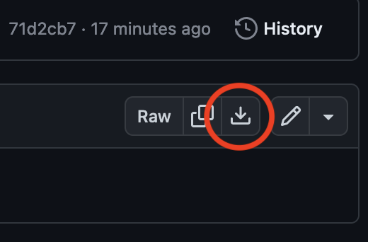

# Introduction-to-R
This repository contains the complete script for the "Introduction to R" workshop from November 2023.

We have compiled an HTML document from all lessons, containing all the information from the workshop as well as additional exercises for you to go through in your own time.

We recommend that you download the [HTML_Introduction_to_R_November_2023.html](https://github.com/Matthijnssenslab/Introduction-to-R/blob/main/HTML_Introduction_to_R_November_2023.html) file and open it in your browser. 

To do this, click on the link and on the following webpage, click on the download icon at the right side of the page.

{:height="60%" width="60%"}

Enjoy!